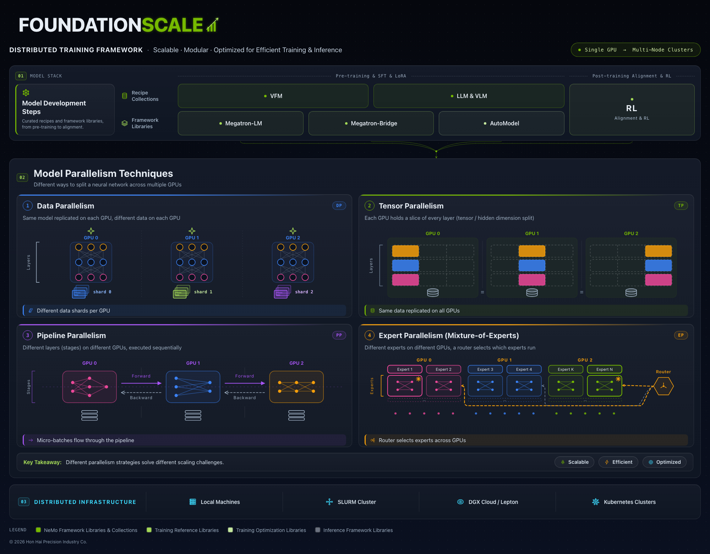

<p align="center">
  
</p>

<h1 align="center">FoundationScale</h1>

<p align="center">
  <b>A verification plane for large-scale training, with a thin training entry point on top of it.</b>
</p>

FoundationScale is a Python package of **gates**: correctness checks that run at defined
points in a training job's lifecycle (launch, build, data, first save, every save, export)
and can block. What separates a gate from an assertion is that its verdict carries its own
coverage — a gate that examined zero units reports `VACUOUS` and blocks, not `PASS`. On top
of the gate plane sits a deliberately thin training entry point that validates the declared
topology, hands the actual training step to `transformers.Trainer`, and runs the save gates
on the result. It is not a from-scratch trainer, and this README will not pretend otherwise.

## Contents

1. [What FoundationScale is](#1-what-foundationscale-is)
2. [Why it exists](#2-why-it-exists)
3. [Core design principles](#3-core-design-principles)
4. [Status — what exists, what is experimental, what is missing](#4-status--what-exists-what-is-experimental-what-is-missing)
5. [Architecture overview](#5-architecture-overview)
6. [Supported hardware and platforms](#6-supported-hardware-and-platforms)
7. [Supported training workflows](#7-supported-training-workflows)
8. [Installation](#8-installation)
9. [Quick-start](#9-quick-start)
10. [Basic training example](#10-basic-training-example)
11. [Configuration](#11-configuration)
12. [Model integration](#12-model-integration)
13. [Dataset integration](#13-dataset-integration)
14. [Distributed training](#14-distributed-training)
15. [Multi-node training](#15-multi-node-training)
16. [Custom workload development](#16-custom-workload-development)
17. [Advanced customization](#17-advanced-customization)
18. [Extension and plugin points](#18-extension-and-plugin-points)
19. [Performance and throughput considerations](#19-performance-and-throughput-considerations)
20. [Checkpointing and recovery](#20-checkpointing-and-recovery)
21. [Monitoring and debugging](#21-monitoring-and-debugging)
22. [Examples](#22-examples)
23. [Project structure](#23-project-structure)
24. [Development guide](#24-development-guide)
25. [Testing](#25-testing)
26. [Troubleshooting](#26-troubleshooting)
27. [Contributing](#27-contributing)

---

## 1. What FoundationScale is

Three things, in increasing order of size:

* **The gate contract** (`src/foundationscale/gates/core.py`). Frozen. Pure stdlib — the
  core installs with zero dependencies so a verifier runs on a bare login node.
* **The gate plane around it**: reference gates and fixtures
  (`src/foundationscale/gates/example.py`, `src/foundationscale/gates/fixtures.py`,
  `src/foundationscale/gates/checkpoint_gates.py`,
  `src/foundationscale/gates/objective_gates.py`), an adjudication layer
  (`src/foundationscale/gates/adjudication.py`), checkpoint I/O
  (`src/foundationscale/checkpoint/dcp.py`), parity checking
  (`src/foundationscale/verify/parity.py`), run-manifest provenance
  (`src/foundationscale/provenance/manifest.py`) and topology validation
  (`src/foundationscale/topology.py`).
* **A thin training entry point** (`src/foundationscale/train/cli.py`,
  `src/foundationscale/train/loop.py`) that validates the declared topology and profile,
  delegates the step to `transformers.Trainer`, and runs the save gates over the result.

Beside the package: a launch plane of estate-specific shell launchers, and an experimental
H100 validation harness. Both are described in §6 and §15.

## 2. Why it exists

FoundationScale grew out of a forensic audit of a real distributed-training estate
(published here under pseudonyms), whose central finding was:

> **The dominant failure mode in large-scale training is not a crash. It is a run that
> reports success.**

The record includes a checkpoint holding a fraction of its required bytes that passed
every check in front of it, and the verification tool written to detect that corruption
itself reporting success over an empty comparison set — `all([])` is `True`. The full
evidence chain, with each claim graded by how it was established, lives in
[`docs/deliverables/`](docs/deliverables/README.md); the reasoning spine is
[`docs/DECISIONS.md`](docs/DECISIONS.md). The framework is the audit's review rules made
executable.

## 3. Core design principles

* **A verdict is a claim about coverage.** `PASS` means "examined N units, all correct".
  Zero examined units is `VACUOUS` and blocks; fewer than expected without a declared
  sample is `UNDERCOVERED` and blocks.
* **Controls are executable.** Every gate declares `MUST_FIRE` fixtures (broken input it
  must block) and typically `MUST_PASS` fixtures (known-good). A gate with no `MUST_FIRE`
  control fails the build.
* **Gates fail closed.** An exception inside a gate is `ERROR`, and `ERROR` blocks.
* **Absence blocks, one level up.** Callers declare required gates; any that never ran
  render as `MISSING` and block the report.
* **An unqualified count is not a fact.** This README follows it too: numbers appear only
  in wordings the repository's own drift gate can re-check.

The `VACUOUS`/`UNDERCOVERED` verdicts are the design, not edge cases, and the rule is
enforced in the base class — `Gate.ok()` cannot return `PASS` on zero coverage no matter
what the author writes. [-> docs/DESIGN_PRINCIPLES.md]

## 4. Status — what exists, what is experimental, what is missing

**Exists and runs in CI today:** the gate contract; the reference and domain gates; the
controls entry point; the mutation battery; checkpoint manifest/parity machinery; the
launcher contract suites; the H100 validation harness's gate scripts.

**Thin, on purpose:** the training entry point is a delegating shim over
`transformers.Trainer`. It owns no `nn.Module`, no parallelism engine, no scheduler.
Anything Trainer can run, it can run gated.

**Experimental:** `h100_validation/` is a working harness for one specific H100 estate,
full of `patch_*.py` scripts and hardening work in flight. It is on the record, not a
stable API.

**Unimplemented or incomplete, stated rather than implied:**

* No gate has run against a real multi-rank distributed checkpoint in this repository's
  CI — the suite writes checkpoints single-process and reads them back.
* Several modules sit below the aggregate coverage floor CI enforces and pass it anyway,
  carried across the line by the rest. `checks/coverage_floor.py` states each one with its
  own floor instead of averaging it away; its generated table separates ratchets from
  debt, and a debt line is an admission with a delete-condition, not a standard. The
  aggregate is still enforced — the two go red on different things. The per-module numbers
  are deliberately not repeated here: no drift gate can re-check them, because CI measures
  the census with `--no-coverage`. They live in that table, next to the run that produced
  them.
* The mutation table is hand-maintained; a rule nobody listed is a rule nobody tests.
* The roadmap with per-phase falsification conditions is
  [`docs/deliverables/D_roadmap.md`](docs/deliverables/D_roadmap.md).

## 5. Architecture overview

Bottom to top:

```
gate contract (stdlib-only core: Verdict, Gate, REGISTRY)
   ├── gate domains        checkpoint / objective / probe / example + fixtures
   ├── adjudication        composes gate verdicts into a run-level judgment
   ├── checkpoint + verify DCP metadata, parity checks
   ├── provenance          the run manifest — what was claimed, measured, emitted
   ├── topology            validates the declared parallel geometry
   └── train/              cli + loop: validate → delegate to Trainer → save gates
```

The load-bearing idea: layers above may only emit a verdict they earned — a composite gate
propagates its children's coverage rather than minting a pass they never produced.
[-> docs/ARCHITECTURE.md; the full L0–L6 design is
docs/deliverables/B1_architecture.md]

## 6. Supported hardware and platforms

* **The gate plane** targets Python 3.10, 3.11 and 3.12 (the CI matrix) and is
  OS-independent; the core needs nothing beyond the stdlib. Checkpoint I/O needs the
  `[checkpoint]` extra (torch, safetensors, numpy).
* **The launch plane** (`launchers/`) has been exercised on exactly one estate: Slurm and
  enroot container backends (`FS_BACKEND=auto|slurm|enroot` in
  `launchers/fs_container_backend.sh`), one H100 tray. It is a concrete, hardened example,
  not a portable launcher.
* Local machines, DGX Cloud / Lepton and Kubernetes appear on the poster as design
  targets from the audit's scaling work (docs/deliverables/B2_scaling.md). In this
  repository they are **unmeasured**: nothing here has run on them, and what would measure
  them is the roadmap's structured-harness phases, not a claim in a README.

## 7. Supported training workflows

* **Via the package**: any workflow `transformers.Trainer` supports, run under the gate
  plane — the loop validates topology and profile first, and save gates fire on the
  result. Model-agnostic by construction.
* **Via the launchers as reference material**: one full fine-tune and one LoRA workflow
  (`launchers/launch_g4e4b_fullft_1tray.sh`, `launchers/launch_g4e4b_lora_1tray.sh`),
  estate-parameterized through environment variables rather than hard-coded paths.
* **Not yet**: RL/post-training alignment pipelines, pre-training recipes and the unified
  data contract remain roadmap items with falsification conditions in
  docs/deliverables/. Nothing in the tree implements them.

[-> docs/WORKFLOWS.md]

## 8. Installation

From a clean clone, exactly what `make install` and CI run:

```bash
git clone https://github.com/TranNhiem/FoundationScale && cd FoundationScale
python -m pip install -e ".[checkpoint,dev]" "pytest-cov>=5" \
    --extra-index-url https://download.pytorch.org/whl/cpu
```

The extras, as declared in `pyproject.toml`:

| extra | contents | when |
|---|---|---|
| *(none)* | stdlib only | running the gate contract itself |
| `checkpoint` | torch, safetensors, numpy | checkpoint gates and the real-checkpoint tests |
| `dev` | pytest, ruff, mypy | development |
| `train` | torch, transformers, datasets, accelerate | the training entry point |
| `all` | everything | exists so `all` means all; CI deliberately does **not** install it |

Omitting `[checkpoint]` does not fail loudly — it shrinks the suite through skips, which
is precisely why CI forbids skips entirely (§25). Requires Python ≥ 3.10.

## 9. Quick-start

Every command below is what CI itself executes (the Makefile targets mirror the CI steps
exactly; the source of truth is `pyproject.toml` plus `.github/workflows/ci.yml`):

```bash
# after installing per §8:

# 1. Unit and gate suite, coverage floor included
python -m pytest --cov=foundationscale --cov-report=term-missing --cov-fail-under=90

# 2. Gate controls: every registered gate's MUST_FIRE / MUST_PASS fixtures.
#    Exits nonzero if a gate fails to block its defective input, declares no
#    MUST_FIRE control at all, or the registry is empty.
python -m foundationscale.gates.controls

# 3. Mutation battery, one module shard the way CI runs it:
python tools/mutate.py --list        # names the modules
FS_FORBID_SKIPS=1 python tools/mutate.py --module checkpoint_gates

# 4. Everything at once (lint, typecheck, skip-guard probe, tests, controls,
#    packaging and countables gates, full mutation corpus):
make check
```

To run the suite byte-for-byte as CI sees it: `FS_FORBID_SKIPS=1 make test`. [->
docs/GETTING_STARTED.md]

## 10. Basic training example

The honest hello-world for this repository is a **gate**, because that is the artifact
that exists end-to-end. This runs verbatim against the installed package:

```python
from foundationscale.gates.core import REGISTRY, Verdict
from foundationscale.gates.example import ExpertCheckContext   # importing registers the gate
from foundationscale.gates.fixtures import make_empty_experts

gate = REGISTRY.get("checkpoint.expert_alias")
ctx = ExpertCheckContext.from_expert_set(make_empty_experts(declared_expert_count=128))
result = gate.run(ctx)
print(result.render())
assert result.verdict is Verdict.VACUOUS and result.blocking
```

For the training path: `pip install 'foundationscale[train]'`, then use the
`foundationscale-train` console script (also runnable as
`python -m foundationscale.train.cli`). Without the extra, the loop refuses and prints the
install remedy rather than half-starting. The loop reads `FS_RUN_ID` and `FS_ATTEMPT`
from the environment. A worked end-to-end recipe, including a toy dataset, is specified
but not yet written. [-> docs/TRAINING.md]

## 11. Configuration

Three layers, three mechanisms:

* **The package** takes configuration as Python objects (context objects per gate,
  topology/profile declarations for the train loop) — there is no global config file.
* **The train loop** reads `FS_RUN_ID` and `FS_ATTEMPT` from the environment.
* **The launch plane** is configured entirely through environment variables, so that no
  account name, hostname or path is committed: `CLUSTER_HOME` (estate root),
  `FS_ALLOWED_NODE` (required, no default — an unset guard is a disabled guard),
  `FS_FORBIDDEN_NODES`, `FS_BACKEND`, `FS_USE_TORCHRUN`, and many more. No single
  reference enumerates them yet; today they are documented in the header comments of the
  launchers themselves, which is where they are enforced. [-> docs/CONFIGURATION.md]

## 12. Model integration

Model-agnostic framing is a rule here: no example in the documentation should imply one
model family. The seams that exist:

* The train path delegates to `transformers.Trainer`, so any architecture Trainer can
  construct is usable; the package validates the declared topology around it rather than
  wrapping the model class.
* `src/foundationscale/models/adapters.py` and `src/foundationscale/integrate.py` are the
  package's own model-touching modules — both thin by measurement.
* The launchers demonstrate a vision-language model end to end, but every estate value
  (paths, model root, node identity) enters via environment, not source.

What is *not* present: a curated recipe library or a parallelism-aware model wrapper. The
catalogue on the poster is the audit's design output, not code in this tree.
[-> docs/MODEL_INTEGRATION.md]

## 13. Dataset integration

The same honest shape as models: datasets reach training through the `[train]` extra's
`datasets` library via `transformers.Trainer`; FoundationScale adds no dataset
abstraction of its own today. The audit's "one data contract" design
(docs/deliverables/B2_scaling.md) is where a first-class dataset layer is specified, and
it is unimplemented. [-> docs/DATASETS.md]

## 14. Distributed training

What ships locally: `src/foundationscale/topology.py` validates the declared parallel
geometry before any process group exists, so a nonsense layout fails on the login node
rather than at NCCL init. Actual multi-process orchestration lives in the launch plane:
`launchers/fs_container_backend.sh` routes every in-container step — preflight probes and
the training run alike — through one backend function, with `FS_USE_TORCHRUN` selecting
torchrun on the enroot arm. A library-level distributed runtime (the DP/TP/PP/EP
strategies on the poster) is design-stage; do not read this section as an API.
[-> docs/DISTRIBUTED.md]

## 15. Multi-node training

Not implemented in the package. The shipped launchers are single-tray (one node) by
construction, and their node guards — `FS_ALLOWED_NODE`, `FS_FORBIDDEN_NODES` — exist
precisely so a script cannot wander onto another team's hardware by accident. The
multi-node story today is `h100_validation/`: an experimental harness carrying the
hardening patches, launch gates and evidence documents for scaling one H100 estate, with
its own README at [`h100_validation/README.md`](h100_validation/README.md) and published
deliverables under `h100_validation/h100/`. Treat it as a lab notebook that CI gates, not
as supported surface.

## 16. Custom workload development

The well-supported extension is writing your own gate, over your own workload:

1. Subclass the base in `foundationscale.gates.core`; implement `check()`, returning
   `self.ok(..., coverage)` with the examined-units count attached — the base class
   downgrades a zero-coverage `ok()` to `VACUOUS` for you.
2. Declare fixtures: at least one `MUST_FIRE` input your gate must block, and a
   `MUST_PASS` known-good input so a gate that blocks everything is also caught.
3. Importing registers the gate in `REGISTRY`; `foundationscale-controls` then runs your
   fixtures against it like any built-in gate.

The reference implementation to copy is `src/foundationscale/gates/example.py`, whose
empty-expert-set case is deliberately *not* special-cased — the contract's downgrade is
the fix, and the fixture exists to prove nobody bypasses it. [-> docs/CUSTOM_GATES.md]

## 17. Advanced customization

* **Required gates at a lifecycle point.** Callers declare which gates must run; any that
  never did render as `MISSING` and block the report — the empty-registry vacuity, one
  level up.
* **Adjudication** (`src/foundationscale/gates/adjudication.py`) composes per-gate
  verdicts into a run-level judgment, propagating coverage instead of assent.
* **The controls runner is itself an entry point**
  (`foundationscale-controls` = `foundationscale.gates.controls:main`), so a gate added to
  the registry is automatically audited by CI's `controls` job.

## 18. Extension and plugin points

Concrete today: the gate base class, the fixture/controls protocol, `REGISTRY` (populated
by import), and the adjudication layer. There is no setuptools entry-point discovery
mechanism for third-party plugins — registration is by import, and whether that should
grow into an entry-point group is an open design question. Anything else advertised as a
"plugin API" would be invention; the boundary is the gate contract and nothing wider.
[-> docs/EXTENSION_POINTS.md]

## 19. Performance and throughput considerations

Training-throughput numbers: **none exist in this repository, and none are claimed.** No
benchmark has been run that this README could attach; publishing one requires the
roadmap's harness phases. What is measured is the cost of the verification machinery
itself, from the Makefile's own accounting:

* The mutation battery runs the whole pytest suite per scoreable row. Measured: one five-row
  module shard took 3m19s on an M-series laptop (~40s per row); **extrapolated, not
  measured**, the full corpus sits near 50 minutes, which is why CI shards it one module
  per job under an inner deadline.
* CI's pytest leg carries a coverage floor of 90; the mutation and controls jobs exist
  because a suite that only answers "does the code pass" cannot answer "does the suite
  detect wrong code".

## 20. Checkpointing and recovery

* `src/foundationscale/checkpoint/dcp.py` and `dcp_meta.py` handle checkpoint I/O and
  metadata indexing; `src/foundationscale/gates/checkpoint_gates.py` and
  `src/foundationscale/verify/parity.py` are where checkpoints are *judged* — the expert-alias
  reference case encodes the estate's defining incident.
* Recovery knobs exist in the harness (`FS_RESUME_CKPT`, `FS_RESUME_STEP` appear in the
  launch-plane environment surface), wired to the launchers rather than the package.
* **Stated limit from §4, repeated where it bites:** the suite writes real checkpoints to
  disk and reads them back single-process. Multi-rank save/reload shapes are reproduced
  from the audit record, not re-observed — so multi-rank recovery is *specified*, not
  *verified here*. [-> docs/CHECKPOINTING.md]

## 21. Monitoring and debugging

* Every gate verdict renders with its coverage inline — "[VACUOUS] … examined 0 of 128"
  is the debugging affordance, not an error format.
* `tools/emit_run_manifest.py` refuses dishonest emissions: the run manifest
  (`src/foundationscale/provenance/manifest.py`) is where what-was-claimed vs
  what-was-measured is made explicit for a run.
* `tools/real_checkpoint_probe.py` is a thin CLI over `foundationscale.gates.probe`, and
  `tools/live_save_gate.py` adjudicates the first real save of a job — the same pattern:
  logic in the package, thin CLI at the edge.
* CI's own debugging doctrine — exit-code-only wiring is distrusted everywhere; a summary
  line with a denominator is required before a green is credited. [-> docs/OBSERVABILITY.md]

## 22. Examples

* **The gate example** in §10 — runnable today, covers the defining incident.
* **The launchers** — two complete, gated single-estate training jobs, readable as
  worked examples of launch-time verification (§7, §15).
* **The harness evidence** — `h100_validation/h100/EVIDENCE.md` and the published
  deliverables show gates firing against real launches.
* **`examples/`** exists at the repository root. Its contents are unmeasured by the
  evidence slice this README was written from; interactively, `ls examples/` is what
  measures them. [-> docs/EXAMPLES.md — the catalogue that should exist]

## 23. Project structure

`src/` = 18849 LOC across 25 files. `launchers/` contains 9500 shell LOC plus 1615 Python
LOC, and `h100_validation/` adds another 31313 Python LOC and 4986 shell LOC on top of the
package. repo-wide, 115500 git-tracked .py/.sh/.md lines.

```
src/foundationscale/   the package: gates/, checkpoint/, verify/, provenance/,
                       topology.py, models/, train/, integrate.py
tests/                 the test suite (29092 .py LOC); conftest carries the skip guard
tools/                 contains 8916 Python LOC of CLIs over the package (emit_run_manifest,
                       live_save_gate, real_checkpoint_probe, preflight, mutate, census)
checks/                standalone repository gates: countables drift, packaging
                       reachability, bash -lc sweep, workflow YAML audit
launchers/             the estate launch plane + two contract suites (bash), plus
                       Python helpers (lora target census, peft override replay)
h100_validation/       experimental H100 harness: build script, gate_*.py, patch_*.py,
                       its own tests, and the published h100/ deliverables
docs/                  DECISIONS.md, deliverables/ (A1–D), SELF_AUDIT.md
examples/              see §22
.github/workflows/     CI: check / controls / launchers / mutation shards
```

## 24. Development guide

The Makefile is convenience only; CI mirrors, it does not consume it.

| command | what runs |
|---|---|
| `make install` | editable install with `[checkpoint,dev]` + pytest-cov |
| `make test` | pytest with the coverage floor |
| `make lint` / `make fmt` | ruff check/format over `src tests tools checks` |
| `make typecheck` | mypy over `src` plus the three adjudicating `tools/` CLIs |
| `make typecheck-checks` | reports on `checks/` — deliberately not a gate |
| `make controls` | the gate controls entry point |
| `make packaging` | the packaging-reachability gate, self-test first |
| `make countables` | census + drift gate over the shipped documents |
| `make mutation` | full mutation corpus; `make mutation-module MODULE=x` for one shard |
| `make skip-guard-probe` | proves the armed skip guard can fail and names its probe |
| `make check` | all of the above |

Stated exclusions, so silence does not read as coverage: mypy does not check `checks/`
or `tools/preflight.py` (the latter carries an explicit exemption); ruff covers
everything listed. [-> docs/DEVELOPMENT.md]

## 25. Testing

* `pytest` is configured in `pyproject.toml` (`testpaths = ["tests"]`, markers `slow` and
  `integration`, `--strict-markers`).
* **Skips are failures in CI.** `FS_FORBID_SKIPS=1` is set job-wide and
  `tests/conftest.py` names every skip with its reason; a probe step feeds the guard a
  deliberately skipped test and requires it to fire. On a laptop the variable stays
  unset and skips are merely named.
* **Mutation testing asks the other question.** The mutation corpus is 78 rows over 9
  modules. Of those, 69 are MUST_FIRE mutants and 9 are MUST_PASS controls. Exit codes
  separate "a mutant survived" (1) from "nothing was measured" (2) — a red suite, any
  skipped test, or a stale anchor all read as never-measured, never as caught.
* **CI has four jobs on purpose**: `check` (hygiene across Python 3.10/3.11/3.12),
  `controls` (gate fixtures), `launchers` (the bash contract suites plus the workflow-YAML
  and bash-`lc` standing legs), and `mutation` (sharded per module, enumerated from the
  mutation table itself). [-> docs/TESTING.md]

## 26. Troubleshooting

| symptom | cause worth checking |
|---|---|
| Many tests "skip" instead of failing | torch missing: you installed `[dev]` without `[checkpoint]` (§8). |
| `foundationscale-train` refuses at startup | the `[train]` extra is absent; the loop prints the exact remedy — install it. |
| `make ...` says `python: command not found` | the Makefile uses `python3` deliberately; bare `python` does not exist on modern macOS. |
| Launcher contract suite fails with "0/8 launcher unreadable" | it is CWD-sensitive by measured behaviour; run it from the repository root. |
| Mutation battery exits 2 | deliberate: nothing was measured (stale anchor, red suite, or a skip). Fix the cause; do not re-run hoping for 0. |
| A number in a doc looks wrong | run `make countables` — the drift gate compares shipped wording against a freshly measured census. |

[-> docs/TROUBLESHOOTING.md]

## 27. Contributing

* Run `make check` before opening a PR; CI runs the same steps across the matrix.
* Follow the repository's two standing review rules: every count carries its denominator,
  and every claim that something does not exist names the control proving its detector
  could have fired. The drift gate (`checks/countables_drift.py`) enforces the first on
  shipped numbers — state counts only in wordings it anchors.
* Write the MUST_FIRE control with the gate. A check that has never been observed going
  red is not evidence.
* License: [MIT](LICENSE). The audit documents carry their own grading scheme
  ([M]/[V]/[A]/[K]/[U]) — see docs/DECISIONS.md before editing them.

[-> docs/CONTRIBUTING.md]
