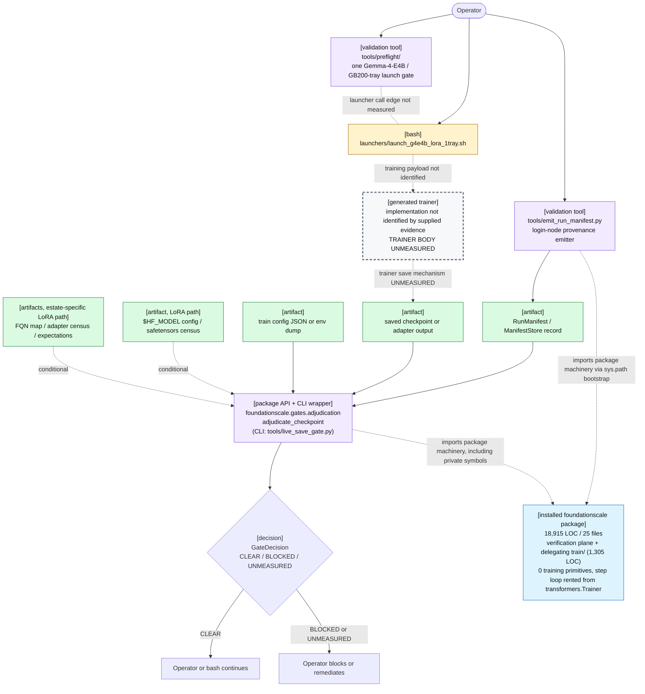
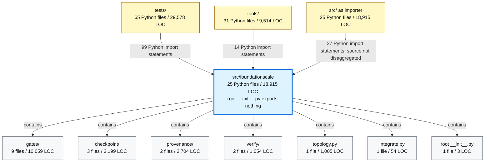

# Deliverable 2 — Current Architecture Diagram

## 1. Runtime path as it exists today

The installed package implements **zero training primitives of its own** — which is not the same as containing no trainer. Measured across all 25 git-tracked `src/*.py` files:

| Training construct searched in `src/` | Measured result |
|---|---:|
| `nn.Module` subclass | 0 files |
| optimizer step | 0 files |
| backward | 0 files |
| dataloader | 0 files |
| forward pass | 0 files |
| distributed collective | 0 files |
| module-scope `torch` import | 0 files |
| any-scope `torch` import | 3 files: `checkpoint/dcp.py`, `verify/parity.py`, `train/loop.py` |
| **delegated trainer construction** | **1 file: `train/loop.py` — `Trainer(...)`, `trainer.train()`, `trainer.save_model()`, `AutoModelForCausalLM.from_pretrained`, `DataCollatorForLanguageModeling`** |

The last two rows are the ones the original six-marker probe could not see, and the earlier draft of this document read its zero as an absence. `src/foundationscale/train/` (1,360 lines: `loop.py` 1,168, `cli.py` 108, `__main__.py` 55, `__init__.py` 29) is a real training entry point that delegates the step loop to `transformers.Trainer` and imports torch at *function* scope, so all six primitive markers read 0 over a module that trains (findings #223, #245). The correct reading is **delegation, not absence**: the package owns the run lifecycle, the manifest and the gate sweep, and rents the step loop.

The verification plane is real work and should be preserved: `gates/core.py`, checkpoint readers, `storage_id` identity, parity comparison, provenance capture, mutation controls, and fail-closed exit semantics all have Keep-classified findings. What is thin is not the trainer's existence but its coverage — `train/loop.py` is exercised at 62% against ≥81% for every other module (#228) — and its reach: it drives one `transformers.Trainer` path, not the Megatron/NeMo estate the launchers actually run.

The supplied findings do **not** identify the *generated* (launcher-side, in-container) trainer's implementation files or verify the launcher-to-generated-trainer call graph; that trainer is distinct from the packaged `train/` entry point and remains an explicit evidence gap in the diagram below. The only launcher specifically named by the findings is the Gemma-4-E4B LoRA launcher used by the one-launch preflight and census control.

### What the diagram establishes — and what it deliberately does not

- The operational plane is shell and tool-heavy: `launchers/` contains 10,234 shell LOC plus 1,615 Python LOC, while `tools/` contains 9,514 Python LOC. `validation_campaigns/h100_validation/` adds another 31,313 Python LOC and 4,986 shell LOC.
- The installed package is consumed by tools, but the measured `run_event` call-site count is **0 in both `tools/` and `validation_campaigns/h100_validation/`**. No evidence shows an actual trainer firing the lifecycle engine.
- The package's three-line `__init__.py` exports nothing, so there is still no top-level public surface. The production save-gate decision function `adjudicate_checkpoint` **is now importable** from `foundationscale.gates.adjudication` (moved during this review, T2#0), but it is reachable only by its fully-qualified submodule path, and 60 private names still cross the boundary through the `tools/live_save_gate.py` compatibility shim.
- There is **no load-side path after saving**: the `Lifecycle` enum has no `RESUME`, `LOAD`, `BEFORE_LOAD`, or `RESTORE` member.
- The generated/estate trainer path is **UNMEASURED**. The dotted trainer edges are evidence gaps, not claims that no trainer exists anywhere in the repository.

## 2. Measured import graph and package inventory

The census reports counts per importing area, not unique dependencies or a file-to-file import matrix. Numbers below are therefore import-statement counts, exactly as measured. The package-to-module edges are containment, not inferred dependency direction.

No separate package-import count was supplied for `launchers/` or `validation_campaigns/h100_validation/`; that must not be read as zero. Separately, the measured count of `run_event(` call sites is 18 in `tests/`, 2 in `src/`, 0 in `tools/`, and 0 in `validation_campaigns/h100_validation/`.

| Package component | Measured LOC | Present responsibility | Runtime qualification |
|---|---:|---|---|
| `gates/` | 6,768 | Verdict/coverage engine, checkpoint gates, objective gates, fixtures, controls runner | Engine exists; no measured production-trainer lifecycle caller |
| `checkpoint/` | 2,199 | DCP/metadata reading, storage identity, weight-source probing | Readers are present; trainer-owned saving is not established |
| `provenance/` | 2,584 | Run manifests and capture/store machinery | Launch-side emitter uses it; in-process trainer resolver is missing |
| `verify/` | 1,054 | Weight parity comparison and parity gate | Package `verify/__init__.py` exports nothing |
| `topology.py` | 1,005 | Parallelism dimensions and cluster-profile validation | Only `slurm-generic` and `local-single-node` profiles ship |
| `integrate.py` | 54 | Tiny integration surface | No trainer integration demonstrated |

## 3. Declared-product layers versus what exists

This table uses the declared scope in the question as the reference architecture. Absence claims below are scoped to the shipped package unless explicitly labelled estate scoped.

| Layer expected for the declared product | What exists today | Status |
|---|---|---|
| End-user training entry point | `src/foundationscale/train/cli.py` exists and is registered as the `foundationscale-train` console script (`[project.scripts]`, added by #224). It drives one backend. `ExecutionBackend` — the pluggable-backend protocol B1/B2 document — appears in docs but is defined in zero source files | **PRESENT (single-backend); the documented multi-backend protocol is MISSING** |
| First training run | A README Quickstart exists, but it exercises tests, the controls runner, and mutation checks only — no model, dataset, or GPU | **MISSING training quickstart** |
| Model construction | Zero `nn.Module` occurrences in the package | **MISSING from package** |
| Model-family adapter seam | MoE classification around Gemma-style config semantics and a closed three-name routed-count-key set sits in `tools/emit_run_manifest.py`; expert-layout spelling tables are built into package checkpoint gates | **PARTIAL facts, MISSING model-neutral interface** |
| Data loading and tokenization | Zero dataloader occurrences in the package | **MISSING from package** |
| Training loop | Zero forward-pass and backward occurrences in the package | **MISSING from package** |
| Optimization and scheduling | Zero optimizer-step occurrences in the package | **MISSING from package** |
| Distributed runtime | Zero distributed-collective occurrences in the package | **MISSING from package** |
| Parallel topology model | `foundationscale.topology` includes construction-time product validation | **PRESENT as library; production trainer use UNMEASURED** |
| Target-hardware profiles | `_PROFILE_DATA` contains only `slurm-generic` and `local-single-node`; neither is MNNVL-capable | **MISSING H100/H200/GB200/GB300 profiles** |
| Launch orchestration | 10,234 shell LOC in `launchers/`; preflight is scoped to one Gemma-4-E4B / GB200-tray launch; census denominator control is hardwired to one launcher | **ESTATE-ONLY, not a package launcher API** |
| In-process lifecycle hooks | `train/loop.py`'s `FoundationScaleSaveGate.on_save` calls `registry.run(event, ctx)` with `FIRST_SAVE` on the first save and `SAVE` thereafter, and fails closed by setting `control.should_training_stop`. The convenience wrapper `run_event` still has zero production call sites (`gates/core.py`, `integrate.py`, `tools/preflight/_cli.py` only), and `STEP_ZERO`, `LAUNCH`, `EXPORT`, `PROMOTE` have no in-process caller | **PRESENT for the save seam; MISSING for the other four lifecycle points** |
| Checkpoint readers and metadata | `checkpoint/dcp.py`, `checkpoint/dcp_meta.py`, `open_weights`, `read_metadata`, chunk reads, and fail-closed format sniffing exist | **PRESENT; end-to-end trainer consumption UNMEASURED** |
| Trainer-owned checkpoint saving | `train/loop.py` calls `trainer.save_model()` at :1097 and reads `model.state_dict()` at :536 to build the pre-save declaration, and its save callback gates every checkpoint. What is UNMEASURED is the *estate* trainer: the in-container Megatron/NeMo path the launchers drive has no such seam | **PRESENT in the packaged trainer; UNMEASURED in the estate trainer** |
| Save-side checkpoint verification | `gates/checkpoint_gates.py` is 1,974 LOC; census records seven `SAVE` references and seven `FIRST_SAVE` references in `src/` | **PRESENT as package/tool verification** |
| Export parity | `verify/parity.py` is 1,053 LOC and supports trainer/converter artifact comparison through weight sources | **PRESENT as library/tool verification** |
| Resume/load validation | No `RESUME`, `LOAD`, `BEFORE_TRAIN`, `BEFORE_LOAD`, or `RESTORE` lifecycle member exists | **MISSING** |
| Checkpoint identity | `CheckpointMetadata` has exactly `tensors`, `format`, and `origin`; it has no step or iteration field in that dataclass | **PARTIAL; step binding missing from metadata** |
| Objective/RL checks | `objective_gates.py` is 1,205 LOC; its vocabulary and fixtures are RL-specific around GSPO/GRPO/KL/trust-region concerns | **PRESENT but narrow; generic scoping not implemented** |
| Provenance | `provenance/manifest.py` is 2,505 LOC; launch-side emitter imports package machinery | **PRESENT, split; in-process trainer provenance API MISSING** |
| Defect-injection controls | Package exposes `foundationscale-controls`; the save-gate MUST_FIRE machinery and `adjudicate_checkpoint` **moved into `foundationscale.gates.adjudication`** during this review | **PRESENT; no longer script-resident. Residual: MUST_FIRE builders are still referenced through the shim's private re-exports** |
| Public Python API | Three-line package `__init__.py` exports nothing; the `tools/live_save_gate.py` shim re-exports 98 names from `gates.adjudication`, 63 of them private (measured post-T2) | **MISSING stable public surface** |
| Tool discoverability | Only `foundationscale-controls` is a measured console entry point; emit-manifest, mutate, preflight, and census tools lack the same registration story | **PARTIAL** |
| Package troubleshooting/API docs | Zero API-reference or module-reference headings across all 19 markdown files; exactly one markdown file names `from foundationscale` | **MISSING product documentation** |
| SFT, RL, multimodal recipes | Docs contain worked recipes written against an entrypoint and a YAML schema that do not exist. The shipped `train/` entry point is causal-LM SFT over a `datasets` source only — no RL loop, no multimodal collator, no recipe registry that could load those YAMLs | **MISSING executable recipes** |
| Hardware validation plane | `validation_campaigns/h100_validation/` contributes 31,313 Python LOC and 4,986 shell LOC | **CODE PRESENT, estate-scoped; it is not an installed trainer** |
| 100+-node scale evidence | The scaling design's own dissent/open-risk material identifies 100+-node claims as unvalidated | **EXPRESSIBLE, UNMEASURED** |

## 4. One run's evidence-backed artifact walkthrough

There is no verified end-to-end trace of a generated trainer run, so an unqualified “every artifact” claim would fabricate coverage. The following is the complete artifact list supported by the supplied evidence for the save-gated campaign path, in chronological order; trainer-internal files remain an explicit unknown.

| Order | Artifact | Producer / consumer | Current status |
|---:|---|---|---|
| 0 | Human preflight report and optional machine-record file | `tools/preflight/` writes `--json PATH`; the human report goes to stdout | Conditional and operator visible; launcher call edge is not measured |
| 1 | `launchers/launch_g4e4b_lora_1tray.sh` | Bash launch control plane | The launcher specifically named by the verified findings |
| 2 | Run-manifest record | `tools/emit_run_manifest.py` composes package `RunManifest` / `ManifestStore` machinery | Launch-side provenance; no in-process trainer resolver supersedes it today |
| 3 | Generated-trainer payload and its intermediate files | Generated/estate trainer | **UNMEASURED: source files and artifact list not identified by supplied evidence** |
| 4 | Saved checkpoint or adapter output | Training payload writes it; save-gate consumes it | Save mechanism is unmeasured; package offers read/verify machinery |
| 5 | Manifest and checkpoint metadata | `foundationscale.gates.adjudication`, checkpoint metadata constructors, and package readers | Save-side verification inputs |
| 6 | Train-config JSON or environment dump | `foundationscale.gates.adjudication::_load_train_config` and `resolve_train_spec` | Present; candidate key names are explicitly marked unverified in the source |
| 7 | Base-model config, safetensors index, shard headers | Read under `$HF_MODEL` or explicit `--base-model-dir` for the LoRA path | Conditional estate denominator evidence; the current hardcoded fallback path must not ship |
| 8 | FQN-map, adapter-census, and expectation files | Consumed by the LoRA adjudication path | Conditional estate-specific denominator sources |
| 9 | Gate decision and human/machine refusal signal | `adjudicate_checkpoint` returns a decision; bash consumes exit/refusal semantics | Production decision function remains outside the installed package |
| 10 | Accepted or blocked checkpoint disposition | Operator/bash continuation or remediation | No package resume/load gate follows it today |

The training payload has no measured in-process call into `Lifecycle.SAVE` or `run_event`. Consequently, the current architecture is **save-side verification around an estate training path**, not yet a model-agnostic FoundationScale trainer with verification built into its runtime.

> **Census correction (applied post-draft).** This document was written against a census of 13,667 lines in `src/foundationscale/`. The T2 library/script boundary move has since relocated the 2,546-line checkpoint-decision API from `tools/live_save_gate.py` into `src/foundationscale/gates/adjudication.py`, and the fixes landed since have added the rest; `src/foundationscale/` now measures **18,915 lines**. Re-measured after the move, the structural finding is UNCHANGED: 0 files define `nn.Module`, call `backward()`, construct a `DataLoader`, or define `forward`, and 0 files import torch at module scope. The three `optimizer` hits and three `broadcast`/`all_*` hits are gate vocabulary (checkpoint optimizer-state fields; the registry broadcasting a context to gates), not NCCL collectives, and the single `torch.distributed` reference is a read-only DCP reader. What changed is that `src/` now holds real decision logic where it previously held none.
