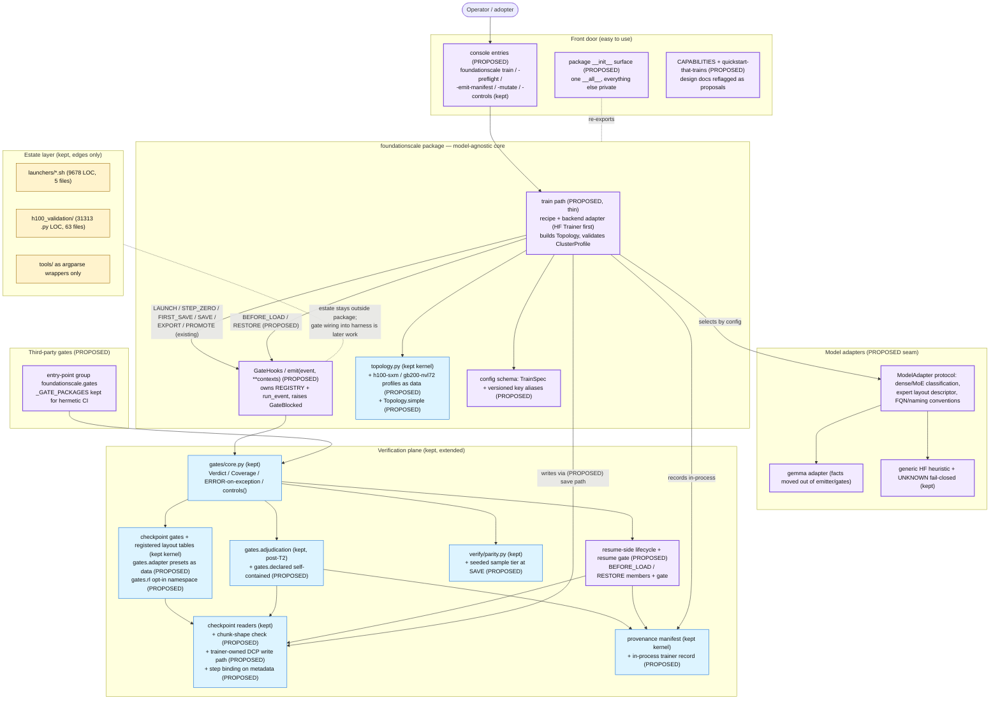

# D5 — Proposed architecture

**Inputs.** D2 (measured current architecture), D3 (ranked problems), D4 (Keep/Simplify/Redesign/Remove/Missing). This document restates none of them; it converts their verdicts into an ordered set of design changes. Every count below comes from the census or the corrected findings.

**Method.** Conservative: only what D3's evidence shows is broken gets redesigned; what D4 classified Keep is listed in the no-change register with its reason. The governing principle orders the work — easy to use → easy to customize → easy to scale — while preserving throughput, GPU utilisation, and reliable distributed training as constraints, not goals of this document (they are properties of the training backend the thin path rides on; the framework's contribution to them, beyond not getting in the way, is unmeasured today).

**The load-bearing fact, restated once — on two axes, because one axis lies.** `src/foundationscale/` measures 18761 lines and implements zero training *primitives*: across all 25 git-tracked `src/**/*.py`, `nn.Module` subclasses 0, optimizer step 0, backward 0, dataloader 0, forward pass 0, distributed collective 0, and `torch` imported at *module* scope 0 (it is imported at function scope in 3 files: `checkpoint/dcp.py`, `verify/parity.py`, `train/loop.py`). But the package does ship a *delegating* trainer — `src/foundationscale/train/`, 1,305 LOC across three files, which constructs a `transformers.Trainer` and calls `trainer.train()`. Reporting only the first axis is finding #223/#245: primitive markers cannot distinguish delegation from not training. The proposals below are sized to the real gap — not "build a trainer" but *backend-neutralise the one that exists*, wire the verification plane into more than its single save seam, isolate model specifics, and extend verification to the load path.

## Target architecture

New or meaningfully-changed components are marked `PROPOSED`. Everything else is existing code that survives unchanged or with the staged migration its block describes. The estate layer (launchers, the H100 validation harness) stays at the edges.

---

## Tier 1 — Easy to use

### D5-1. Trainer-facing gate seam (`integrate.py` becomes the real seam)

  **Current design** — `src/foundationscale/integrate.py` (54 LOC) is a tiny placeholder. Measured `run_event` call sites: 2 in `src/`, 18 in `tests/`, 0 in `tools/`, 0 in `h100_validation/`. The engine has no integration seam into any trainer (B_gate_engine#4, CONFIRMED).
  **Problem** — The lifecycle vocabulary (FIRST_SAVE, SAVE, STEP_ZERO, LAUNCH, EXPORT, PROMOTE) is bound in code but fired by no production caller.
  **Why it is a problem** — The framework's differentiating asset, the gate plane, provides zero runtime protection to any training job. CI stays green because the only adversary is the test suite (D3 theme 2).
  **Proposed design** — In-package `GateHooks`/`emit(event, **contexts)`: owns `REGISTRY`/`run_event`, provides typed context builders (checkpoint-context-from-save-path), and raises `GateBlocked` on a blocking `GateDecision`. One public entry; the broadcast `GateRegistry.run` seam is deprecated in favour of `run_event` with contexts always a Mapping, and stringly `missing_ctx` becomes an `UnwiredPolicy` enum (D4 items 9, 13).
  **Expected benefit** — FIRST_SAVE/SAVE become a contract a real trainer can satisfy in one call per event; every later proposal (resume gate, tiered parity) plugs into the same seam instead of inventing its own.
  **Migration difficulty** — Medium — engine kernel untouched (Keep); the seam is additive, but context builders must be pinned against the existing gate fixtures to avoid a second context dialect.
  **Priority** — P0

### D5-2. Thin, model-agnostic training path

  **Current design** — the package implements zero training *primitives*: across all 25 git-tracked `src/**/*.py` an AST probe finds no `nn.Module` subclass, no `backward()`, no `DataLoader`, no `forward`, no `optimizer.step()` and no module-scope torch import. It does ship a *delegating* entry point — `src/foundationscale/train/` (`loop.py` 1,168 LOC, `cli.py` 108, `__init__.py` 29) builds a `transformers.Trainer` and calls `trainer.train()`. Both statements are true at once, and stating only the first is the #223/#245 error: six primitive markers cannot tell delegation from not training at all. What is genuinely absent is a *backend-neutral* trainer seam — the shipped path is one `transformers` backend, single-node causal-LM SFT, covered at 62% (#228), and it is not the Megatron/NeMo path the launchers drive. No DCP checkpoint writer exists anywhere in the package — readers only.
  **Problem** — The shipped package is not the advertised product (D3 theme 1). Docs describe `ExecutionBackend` (defined in 0 source files, present in docs) and recipes with a nonexistent entrypoint (F1_docs#2, F2_docs#1, both CONFIRMED).
  **Why it is a problem** — Every adopter hits silent disbelief at install time; the repo spends its credibility budget before a GPU is touched. It also leaves the verification plane orbiting an absent planet: save-side gating with no save.
  **Proposed design** — Per A_front_door#0's proposal and D4 M0, deliberately thin: a `foundationscale train`-style entry (or ~20-line example) that (a) builds a `Topology`, (b) validates it against a `ClusterProfile`, (c) launches a maintained backend (HF Trainer DDP first, one file), (d) registers `GateHooks` as a trainer callback, (e) selects a model adapter through the D5-8 registry, and (f) saves via a trainer-owned DCP write path so the readers get a producer from day one. Model construction, data, and optimization stay with the backend; the package contributes topology, gates, checkpoint identity, and provenance. Model-specific pieces enter only as registered adapters (D5-8), never as branches in core.
  **Expected benefit** — The quickstart touches a model, a dataset, and a GPU for the first time; the gate engine acquires its first production caller; the checkpoint plane becomes a closed write→verify loop.
  **Migration difficulty** — High — net-new subsystem; contained by scoping it thin (one backend, one recipe) and by reusing the kept kernels unchanged.
  **Priority** — P0

### D5-3. An honest front door

  **Current design** — README's first screen claims the un-shipped training framework (A_front_door#1, CONFIRMED); the Quickstart exercises pytest, the controls runner, and mutation checks only; B2 and B1 §12 present unimplemented interfaces and a nonexistent entrypoint without disclaimer (F1_docs#2, F2_docs#1); README routes all newcomers into the audit ledger (F2_docs#7).
  **Problem** — Documentation describes a system that does not exist, violating the repo's own doctrine that a wrong-and-present doc is a defect.
  **Why it is a problem** — Readers internalise an architecture, write plans against it, find nothing, and retroactively distrust every doc (D3 theme 4). This poisons D5-2's launch if shipped in the wrong order.
  **Proposed design** — Three moves, all text: (a) a three-line status banner and persona table at the top of the README, audit material relocated to `docs/internal/` with its evidence discipline intact; (b) B2 and B1 §12 reflagged as design-target proposals with status headers until the code lands; (c) a CAPABILITIES page stating shipped vs not-shipped, and a quickstart-that-trains sequenced *with* D5-2, not before.
  **Expected benefit** — First ten minutes stop being the worst ten minutes; docs regain the presumption of truth.
  **Migration difficulty** — Low — prose only; the audit content is relocated, not deleted.
  **Priority** — P0

### D5-4. Self-contained decision path (finding #219)

  **Current design** — `foundationscale.gates.adjudication` imports `tools/real_checkpoint_probe` at module-import time via a dual-arm `try/except` degrading to `None`; `pyproject.toml` packages only `src/`. Measured on a `src/`-only `sys.path` (what `pip install` gives): `_PROBE_IMPORT_ERROR = ModuleNotFoundError`, `derive_declared` unbound, and `derive_declared_block` refuses with "probe helpers unimportable".
  **Problem** — The installed API imports and then declines to decide; the refusal is indistinguishable from a legitimate abstention.
  **Why it is a problem** — The headline benefit of the T2 extraction — an adopter can `pip install` the decision logic — is not yet realised (D3 theme 3 residual).
  **Proposed design** — Move `derive_declared` and `run_alias_control` into `foundationscale.gates.declared` (D4 redesign item 2); delete the `try/except` import contract from the package. Ship the inverted negative leg as a permanent test: import `gates.adjudication` with only `src/` on `sys.path` and assert the helper is bound, so this cannot regress silently.
  **Expected benefit** — The one piece of logic an adopter most wants works from a bare install; a known silent-degradation class becomes a hard error at test time.
  **Migration difficulty** — Medium — the functions are library-shaped already (D4, T2#15 pure seams); dependents migrate behind golden-reference tests.
  **Priority** — P1

### D5-5. A declared public API surface

  **Current design** — The root `__init__.py` (3 lines) exports nothing (A_front_door#2, CONFIRMED); `verify/__init__.py` exports nothing (D_checkpoint_verify#7); the post-T2 compatibility shim in `tools/live_save_gate.py` still re-exports 94 names, 60 of them private, including stdlib names (`Any`, `Path`, `dataclass`) — a generated-from-usage surface, not a designed one.
  **Problem** — There is no stable contract. Callers bind to deep paths or to a script's accident of re-export; the package cannot evolve without breaking unknown consumers.
  **Why it is a problem** — The test suite — `tests/` (28550 .py LOC, 55 files; 96 import statements), the package's largest measured consumer — pins private names, so every refactor fights its own tests (T2#2).
  **Proposed design** — One deliberate surface: the root exports a small `__all__` (D4 M6's candidate list: `Topology`, `ClusterProfile`, `profile_by_name`, `run_event`, `GateRegistry`, `Verdict`, `Finding`, `adjudicate_checkpoint`, `GateDecision`, `TrainSpec`, `GateHooks`); `verify/__init__` mirrors `checkpoint/__init__` with the parity API (`compare_sources`, `WeightParityGate`, `ParityReport`, `TolerancePolicy`). Staged retirement of the shim: migrate dependents to the package path, delete the 60 private re-exports, keep the public names as a deprecation surface for one release.
  **Expected benefit** — Importable, documentable product; the docstring-generated API reference (M13) becomes possible; private implementation stops being load-bearing.
  **Migration difficulty** — Medium — individually easy edits, but the consumer base is the largest in the repo; staged by design.
  **Priority** — P1 (surface), P2 (shim deletion)

### D5-6. Tool discovery and entry points

  **Current design** — Only `foundationscale-controls` is a registered console entry; emit-manifest, mutate, preflight, and the census pair are reachable only by repo path; two tools `sys.path`-bootstrap into `src/` (T1#0, T3#15, both CONFIRMED).
  **Problem** — Installed tools are undiscoverable; bootstraps mask a missing install as success.
  **Why it is a problem** — An adopter following the docs for preflight or manifest emission finds no command to run.
  **Proposed design** — Register `foundationscale-preflight`, `foundationscale-emit-manifest`, `foundationscale-mutate`, and the census pair alongside the future `foundationscale train` (D5-2); delete the `sys.path` bootstraps so a missing install is a hard import error; adopt the 0/1/2 fail-closed exit taxonomy and `--version` slice-wide (D4 CLI rows).
  **Expected benefit** — Every documented tool is a command; install integrity becomes observable.
  **Migration difficulty** — Low — packaging metadata plus entry shims; the wrapped logic already lives in the package after D5-4/D5-10.
  **Priority** — P1

---

## Tier 2 — Easy to customize

### D5-7. Model-adapter interface (the model-agnosticism seam)

  **Current design** — MoE classification uses Gemma-config semantics (`enable_moe_block` plus fallback) with a closed three-name routed-count key set inside `tools/emit_run_manifest.py` (T3_skeptic#0, corrected form); a closed census of Megatron/Mixtral/Qwen/Gemma-4/GPT-OSS projection spellings is hardcoded into `gates/checkpoint_gates.py` (C_gates_domain#1, corrected form); `tensors_per_expert_layer=2`, the megatron-core FQN space, and the `iter_*` glob are frozen as constants (T3_skeptic#5, CONFIRMED).
  **Problem** — The "model-agnostic" infrastructure embeds one campaign's semantics; a new model family's remedy is to edit the framework.
  **Why it is a problem** — Model-agnosticism is a directory layout, not a fact. The first non-Gemma-MoE team becomes a co-owner of the gate codebase before saving a single weight (D3 theme 5). This is the load-bearing piece of the stated mandate.
  **Proposed design** — A `ModelAdapter` protocol: dense/MoE classification, expert-layout descriptor, FQN and naming conventions, denominator keys. Adapters are registered per family and selected by config; the existing tables ship as built-in data (Gemma adapter beside its model; Qwen/Mixtral/Megatron presets for `gates.adapter` as data, selected explicitly, no silent global default); a generic HF heuristic covers the unregistered case; UNKNOWN stays blocking only when neither adapter nor built-in matches — the fail-closed doctrine and all existing tables survive intact. The frozen naming constants become adapter/config inputs with today's values as defaults.
  **Expected benefit** — A new model family is a new adapter file, not a framework patch; the core's vocabulary stops naming one estate.
  **Migration difficulty** — High — touches emitter, checkpoint gates, and adapter presets; each extraction is behaviour-preserving and pinned by the existing fixtures.
  **Priority** — P1

### D5-8. Third-party gate discovery, one runner seam

  **Current design** — Gate registration is import-side-effect over a hardcoded `_GATE_PACKAGES` list (B_gate_engine#3, CONFIRMED); two runner seams (`GateRegistry.run` broadcast vs typed `run_event`) diverge in `required` defaults (B_gate_engine#2, corrected form).
  **Problem** — Only in-repo gates can register; third parties fail or fork; two similar-but-different call paths.
  **Why it is a problem** — "Foundation-model training framework" must be a claim about an ecosystem seam; today that seam does not exist (D4 M5).
  **Proposed design** — Add the setuptools entry-point group `foundationscale.gates`, loaded explicitly by the controls runner and by `GateHooks`; render third-party gates with distribution provenance instead of as failures; keep `_GATE_PACKAGES` for hermetic first-party CI; unify on `run_event` per D5-1.
  **Expected benefit** — External gates register and run; the controls CI's vacuous-registry guard (kept) now also watches third-party loading.
  **Migration difficulty** — Medium — packaging metadata plus one loader; first-party registration unchanged.
  **Priority** — P2

### D5-9. RL objective gates behind an opt-in namespace

  **Current design** — `gates/objective_gates.py` (1205 LOC) is unmistakably RL-flavoured (GSPO/GRPO vocabulary, kl_coef, trust-region); the corrected finding does *not* support global unscoped registration, so nothing is re-scoped that was never scoped.
  **Problem** — RL campaign material sits in the model-agnostic core namespace.
  **Why it is a problem** — Same mandate as D5-7, one layer up: core vocabulary must not presume a training objective.
  **Proposed design** — Move the three RL gates to `foundationscale.gates.rl` as an opt-in package registered through the D5-8 entry-point mechanism; refurbish `fingerprint_hparams` and the RewardStats math as generic utilities in place (D4 redesign item 10).
  **Expected benefit** — Core reads objective-neutral; RL users get identical gates with an explicit opt-in.
  **Migration difficulty** — Low to Medium — a move plus import updates; no behavioural change.
  **Priority** — P2

### D5-10. Complete the extraction pattern; collapse evidenced duplication

  **Current design** — Library logic still lives in scripts: dense-mint derivation (T2#8), safetensors parsing in four `tools/` modules beside the package's readers (T2#3, partly retired), expectation loaders (T2#13), interpreter provenance (T2#12). Three byte-identical duplications between `checkpoint/dcp.py` and `checkpoint/dcp_meta.py` (D_checkpoint_verify#4, CONFIRMED); one *demonstrated* drift — dtype normalisation differs between gate and probe (`str(tm.dtype).removeprefix('torch.')` vs raw, T2#5); `coerce_context` duplicated verbatim across all four checkpoint gates (C_gates_domain#4); malformed-denominator guards reimplemented per gate; manifest field handling in six places per field (E_provenance#3).
  **Problem** — Cross-tool invariants are maintained by vigilance; one has already drifted.
  **Why it is a problem** — Invariants that must be binary-symmetric become left-asymmetric over time, and the failure surfaces as two of the framework's own tools contradicting each other (D3 theme 8).
  **Proposed design** — Finish the one-way T2 pattern: remaining derivations to `gates.declared`; safetensors/header census to `checkpoint.hf`; expectation loaders to `checkpoint.expectations` with a versioned schema; interpreter probing to `provenance.environment`; campaign env prefixes promoted to CLI/config inputs. Collapse duplications to single sources: one private `_layout` module for the dcp/dcp_meta triple, one `build_gate_context` with one documented dtype rule, a `coerce_context` mixin, a shared `checked_nonnegative_declared` helper, and a manifest field-spec driving serialization. Pure seams (`_deliver`, `adjudicate_checkpoint` signatures) are preserved verbatim — they are classified Keep (T2#15) — and pinned by golden-reference tests.
  **Expected benefit** — The drift class measured in T2#5 becomes structurally impossible; tools/ shrinks to argparse wrappers, making D5-6 mechanical.
  **Migration difficulty** — Medium — many small moves, each staged and behaviour-preserving; no working gate semantics change.
  **Priority** — P2

### D5-11. Chunk-shape validation in the reader

  **Current design** — `_read_blob`/`read_box` validate archive-ness but never reconcile decoded tensor shape with declared chunk extents; a wrong-shaped-but-valid tensor escapes the `CheckpointError` contract as a bare `RuntimeError` (D_checkpoint_verify#3, corrected form).
  **Problem** — An honesty gap in the error contract the gates depend on.
  **Why it is a problem** — Callers (and future resume gating, D5-14) cannot distinguish corruption from misuse without inspecting tracebacks.
  **Proposed design** — Compare decoded shape to chunk extents at read time; raise `ChunkReadError` carrying offsets.
  **Expected benefit** — The reader's failure vocabulary matches its contract; downstream gates inherit cleaner evidence.
  **Migration difficulty** — Low — additive check in one read path.
  **Priority** — P2

---

## Tier 3 — Easy to scale

### D5-12. Cluster profiles as data; topology ergonomics

  **Current design** — `_PROFILE_DATA` ships exactly two profiles (`slurm-generic`, `local-single-node`), both with `mnnvl_available=False`; no H100/GB200/MNNVL profile exists (A_front_door#5, corrected form); `dp` must be derived by hand (A_front_door#6, CONFIRMED).
  **Problem** — On the headline hardware, the module greets users with a blank slot where their cluster should be.
  **Why it is a problem** — `ClusterProfile.from_dict` already carries the `mnnvl_available` field, rejects unknown keys, and accepts a profile from JSON — the absence is of *data*, not mechanism, so this is the cheapest perceived-value gap in the repo (D3 theme 6).
  **Proposed design** — Ship `h100-sxm-8x-slurm` and `gb200-nvl72` as data dicts (the latter MNNVL-capable) plus a JSON profile template; add `Topology.simple(n_nodes, gpus_per_node, tp=, pp=, ep=, cp=)` over the unchanged construction-time product check; user-facing errors become one-line cause + one-line fix + docs link. The strict validation itself is Keep (A_front_door#4) and is not diluted.
  **Expected benefit** — H100/GB200 adopters get a named, validated starting point; the estate's proven geometries (it demonstrably runs on both) become package data.
  **Migration difficulty** — Low — dicts in a table plus one convenience constructor; no mechanism change.
  **Priority** — P1

### D5-13. Checkpoint identity: step binding and optimizer classification

  **Current design** — `CheckpointMetadata` is exactly three fields — tensors, format, origin — with no step/iteration binding in that dataclass (D_checkpoint_verify#2, corrected form).
  **Problem** — A checkpoint cannot say *which* training step it represents.
  **Why it is a problem** — Resume-side gating (D5-14) cannot assert anything meaningful about what it is consuming; export/promote consumers have the same hole.
  **Proposed design** — Add an optional step/iteration field (manifest-supplied or well-known key) plus an FQN-convention parameter-vs-optimizer-state classification helper; both optional, zero breaking change.
  **Expected benefit** — Unblocks D5-14; gives the declaration consumer (D5-14's fold-in) a realized iter count to check against.
  **Migration difficulty** — Medium — metadata model change with an all-optional compatibility story.
  **Priority** — P1

### D5-14. Resume/load-side verification

  **Current design** — The `Lifecycle` enum has no `RESUME`, `LOAD`, `BEFORE_LOAD`, or `RESTORE` member at all; every bound event (FIRST_SAVE ×7, SAVE ×7, STEP_ZERO ×4, LAUNCH ×1, EXPORT ×1, PROMOTE ×1) fires on the write path (D_checkpoint_verify#0, CONFIRMED — census-measured). `check_saved_run_declaration` is write-only by its own admission, with no post-run consumer (T3_skeptic#4, CONFIRMED). Whether the load-side path currently protects an H100/GB200 resume is UNMEASURED — no evidence slice covers it.
  **Problem** — Verification exists only after save, never before consume.
  **Why it is a problem** — A corrupt, aliased, or truncated checkpoint sails into storage and is consumed on resume with no structural gate to stop it; "reliable resume" is today a claim, not a measurement (D3 theme 7).
  **Proposed design** — Add `BEFORE_LOAD` and `RESTORE` to `Lifecycle` (keeping all six existing members); add a resume gate wired through `GateHooks`: open target via `open_weights`, assert non-empty keys, read metadata, verify manifest and step binding (D5-13), spot-read N chunks per shard before load. Land the resume/export consumer for `check_saved_run_declaration` as part of this gate, or downgrade that function to private now (D4 redesign item 14).
  **Expected benefit** — The verification plane becomes symmetric: write-side gates and load-side gates on the same identity model; the framework's reliability claim acquires a mechanism.
  **Migration difficulty** — High — depends on D5-1, D5-2, D5-13; first lifecycle extension the engine has taken.
  **Priority** — P1

### D5-15. Coverage-tiered parity

  **Current design** — Full-key serial float64 comparison fires at every SAVE; no sampled or concurrent tier exists (D_checkpoint_verify#1, corrected form). There is also no timing evidence that comparison dominates step time, and no evidence it would be disabled.
  **Problem** — One coverage tier, sized for small models, at every lifecycle event.
  **Why it is a problem** — At 100B-class scales the honest prediction — evidence-free today — is that full-serial parity is exactly the kind of check that gets muted; a check engineers turn off protects nothing. Stated plainly: the benefit below is argued from the scale principle, not from measured pain.
  **Proposed design** — Deterministic seeded K-key sampling at SAVE; full parity reserved for FIRST_SAVE, EXPORT, and PROMOTE; optional parallel chunk reads. The comparator itself is Keep.
  **Expected benefit** — Verification stays on at scale; expensive full checks bind to the events that warrant them.
  **Migration difficulty** — Medium — new policy plumbing around an unchanged comparator; seeded determinism keeps adjudication reproducible.
  **Priority** — P2

### D5-16. In-process trainer provenance

  **Current design** — Provenance machinery (`RunManifest`, `ManifestStore`, `capture_*`) exists and is imported by a login-node script that sys.path-bootstraps into `src/`; no resolver runs inside the training process, so resolved config and byte denominators come from outside the process that produced them (T3_skeptic#11, corrected form); the manifest's ordering contract lives only in prose docstrings (E_provenance#6, corrected form).
  **Problem** — Provenance is launch-side only, and its composition is folklore.
  **Why it is a problem** — The manifest describes a run from the outside; attribution errors at scale are exactly what provenance exists to prevent.
  **Proposed design** — A trainer-side record API: capture resolved config and census at init/first-save from inside the process; one public `record_launch(...)` composer encoding the documented ordering; the launch-time emitter demoted to bootstrap, superseded by the in-process record. Tri-state probe semantics and the atomic no-clobber store (both Keep) are untouched.
  **Expected benefit** — Manifests become first-party measurements of the run, not second-party notes about it.
  **Migration difficulty** — Medium — additive API over a kept kernel; launchers keep working unchanged during the transition.
  **Priority** — P2

---

## No-change register

Per the governing constraint, these components get no surgery. Each entry states why the existing design is right — or, where honestly unmeasured, says so.

- **Gate engine kernel** (`gates/core.py`): Verdict multi-way blocking, frozen Coverage per result, ERROR-on-exception, `controls()` as an abstract requirement. B_gate_engine#0 (corrected form); the strongest kernel in the repo. No change proposed even if everything around it shrinks.
- **Zero-core-dependency stance** of the gate plane (`pyproject.toml`): A_front_door#3, CONFIRMED. The D5-2 thin trainer rides an optional backend; the gate plane stays dependency-free.
- **`storage_id` byte-identity** and the no-fallback rule (`checkpoint/dcp_meta.py`): D_checkpoint_verify#9, CONFIRMED — a structural fix for a real incident.
- **WeightSource protocol + fail-closed `open_weights`** (`checkpoint/dcp.py`): refuses pickle formats with a stated reason; D_checkpoint_verify#10. Kept; only additions land around it (D5-11, D5-14).
- **Tri-state probe contract** (None = failed, 0 = measured-none) and `failed_probes` naming; **hermetic git env + atomic no-clobber manifest store**: E_provenance#0/#1, both CONFIRMED. No reintroduction of `or 0` collapsing.
- **Topology construction-time product check** (`topology.py`): A_front_door#4, CONFIRMED — the standout adoptable piece; D5-12 adds data and ergonomics around it, not through it.
- **Mutation battery core** (runner/scorer/restore) and the **CI controls job** that fails on non-firing MUST_FIRE and on an empty registry: T3_skeptic#13, CONFIRMED, plus the census's CI description. Kept; extended only to watch third-party gate loading (D5-8).
- **preflight's 0/1/2 exit integrity**, **census counter stdout purity**, **denominator control's subprocess-the-artifact composition**, the **import-free `tools/__init__.py` map**: T1#9–#12, CONFIRMED as contracts; only CLI surface polish applies (D5-6/D5-10).
- **`ensure_declaration_is_independent`** and its fail-closed stat layer: T3_skeptic#14, CONFIRMED Keep; unchanged.
- **The bash launchers** — `launchers/*.sh` (9678 LOC, 5 files) — and **the H100 validation harness** — `h100_validation/` (31313 .py LOC, 63 files): preserved per the standing H100/GB200 constraint. Flagged honestly: D4's Keep here rests on census plus constraint, with zero direct findings; launcher internals and the harness are UNMEASURED by this review, not validated. Wiring the harness to `GateHooks` is future work after D5-1, explicitly out of this architecture's scope.
- **`h100_validation/*.sh` (4986 LOC, 4 files)**: same disposition — estate plane, kept at the edges.

## Explicitly not built here

No RL post-training loop, no multimodal data pipeline, no MoE router or expert-parallelism runtime, no eval harness, no serving/export implementation, no sharded-optimizer work. The full stated ambition (4B–100B+, dense+MoE, pre-train/SFT/RL/multimodal) remains EXPRESSIBLE, UNMEASURED end-to-end; this architecture builds the seam those features would plug into (D5-7, D5-8) rather than the features themselves.

## Sequencing and evidence of done

Order follows the tiers: D5-1 through D5-3 land together (a seam nobody calls, a thin caller that calls it, and docs that finally match), D5-4 through D5-6 make the install honest, D5-7 through D5-11 open the customization seams, D5-12 through D5-16 serve scale. Completion is checkable without opinion: the measured `run_event` production call-site count moves off 0 in the trunk trainer; the `src/`-only import test for the decision plane exists and passes; `Lifecycle` gains exactly the two named members; the gate's training-construct probe stays at 0 in the verification plane's modules while the new thin trainer carries the only training constructs in the package; and 118342 git-tracked .py/.sh/.md lines repo-wide remains the denominator of record under the current census method.
